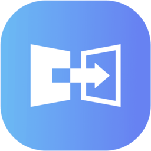
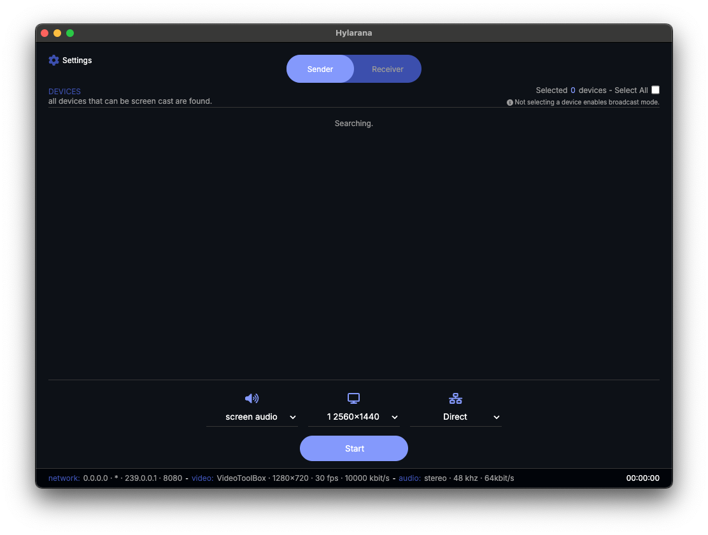

<!--lint disable no-literal-urls-->
<div align="center">
    
    <br>
    <br>
    <h1>Hylarana</h1>
</div>
<div align="center">
    <strong>A cross-platform screen cast implemented by Rust.</strong>
</div>
<div align="center">
    
    
    
    
</div>
<br/>
<br/>
<div align="center">
    
    <span>This is a screen cast application implemented using the hylarana SDK.</span>
</div>
<div align="center">
    <span>Watch it in action on YouTube:</span>
    <a href="https://youtu.be/AkW3eRlKl1U">link</a>
</div>
<br/>

## Introduction

Unlike implementations such as Miracast, AirPlay, etc. that rely on hardware support (WIFI Direct), this library works on most common hardware.

The project is cross-platform, but the prioritized supported platforms are Windows, Android, Macos, with Linux only supported for reception. Unlike solutions such as DLNA, this project is more similar to airplay, so low latency is the main goal, currently the latency is controlled at around 80-250ms (it will be different on different platforms with different codecs), and maintains a very easy to use API and few external dependencies.

Unlike traditional screen casting implementations, this project can work in forwarding mode, in which it can support casting to hundreds or thousands of devices at the same time, which can be useful in some specific scenarios (e.g., all advertising screens in a building).

At the heart of hylarana is an SDK that provides rust crate on desktop and a kotlin implementation on android. And, this project uses the hylarana SDK and CEF to create a screen casting application that supports Macos and Windows. So, hylarana is not a mere application project, the main core is the SDK and the development is focused around the SDK.

## Technical overview

The first is screen capture, this part of each platform independently separate implementation, but all use hardware accelerated texture, Android use virtual display, Windows use WGC, and Macos use screenshencapturekit.

In terms of audio and video codecs, H264 is used for video and Opus is used for audio. Similarly, Windows, Android and Macos all provide hardware accelerated codecs, and the current hardware codecs on Windows are adapted to Qsv and D3D11VA, Android is adapted to Qualcomm, Kirin, and RK series of socs, while Macos uses the Video Toolbox.

Both SRT and UDP multicast schemes are used for the transport layer of the data. The audio and video data transmitted by the transport layer are bare streams and do not contain similar encapsulations such as FLV. For SRT, many parameters have been adjusted in detail to suit the LAN environment, so that when using the SRT transport layer, the delay can be controlled at about 20-40 ms. The UDP multicast scheme has only a receive buffer and no transmit buffer, and the fixed maximum delay of UDP multicast is 40 ms, which is used to sort and wait for packets in the buffer.

The graphics interface also uses two solutions, Direct3D11 and WebGPU. WebGPU is a cross-platform graphics interface wrapper library, but WebGPU can't work on some old devices on Windows, because WebGPU needs at least Direct3D12 support, so Direct3D11 is provided on Windows. Similarly, the graphics implementations for Windows, Android, Macos are all fully hardware accelerated. In general, the capture, encoding, decoding and display of a video frame is performed inside the GPU, and the scaling and formatting of video frames on Windows is also fully hardware accelerated. For Macos and Android the situation is somewhat less so, except for YUV textures which are not available hardware accelerated, otherwise in line with Windows, they are fully hardware accelerated.

## Project structure

-   [android](./android) - The SDK provided for Android use is a Native Module implemented using Kotlin.
-   [app](./app) - android applications and desktop applications packaged using CEF.
-   [capture](./capture) - Cross-platform screen/audio capture implementation, but no Linux support.
-   [codec](./codec) - Codec implementation that handles H264 and Opus.
-   [common](./common) - The public section, which contains public types, runtime, atomic operations, strings, logging, platform API wrappers, and more.
-   [discovery](./discovery) - LAN discovery implementation using MDNS.
-   [ffi](./ffi) - Cross-language related, providing SDK to different language packaging.
-   [hylarana](./hylarana) - Rust crate, the core SDK implementation used on desktop systems.
-   [renderer](./renderer) - Cross-platform graphics renderer responsible for rendering video frames to the window.
-   [resample](./resample) - Resampling module, responsible for resampling audio, as well as scaling and converting texture formats using D3D11.
-   [server](./server) - An implementation of a forwarding server, which is required when using forwarding mode.
-   [transport](./transport) - The unified transport layer, which internally uses SRT and UDP multicast, provides multiple modes of operation.

## Build Instructions

> ❗ This project has a dependency on ffmpeg version 7.1, because it may need to use gpl or nofree dependencies, so this project is not statically linked to ffmpeg. In this case, you need to manually add the dll or so to the dynamic library lookup path, and you can download the ffmpeg build you need at this [link](https://github.com/mycrl/ffmpeg-rs/releases).

#### Requirements

-   [Git](https://git-scm.com/downloads)
-   [Rust](https://www.rust-lang.org/tools/install): Rust stable toolchain.
-   C++20 or above compliant compiler. (G++/Clang/MSVC)
-   [CMake](https://cmake.org/download/): CMake 3.16 or above as a build system.
-   [Node.js](https://nodejs.org/en/download): Node.js 16 or above as a auto build script.
-   [Python3](https://www.python.org/downloads/): Python 3 is required to use the Android Studio Project.

##### Linux (Ubuntu/Debian)

> For Linux, you need to install additional dependencies to build SRT and other.

```bash
sudo apt-get update
sudo apt-get install unzip tclsh pkg-config cmake libssl-dev build-essential libasound2-dev
```

##### Macos

```bash
brew install cmake ffmpeg@7 wget
```

---

#### Build App

```bash
yarn
cp app/desktop
yarn build:release
```

The build product is under the `target/app` directory.

## License

[MIT](./LICENSE) Copyright (c) 2024 mycrl.
